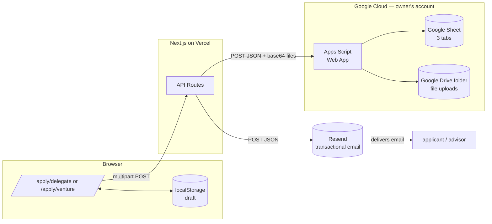
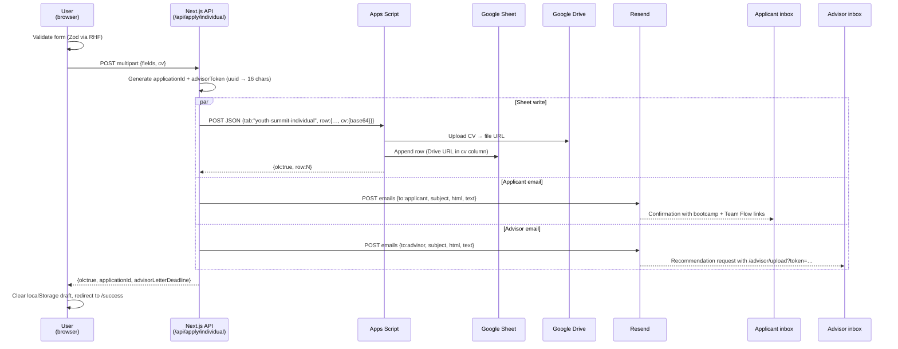
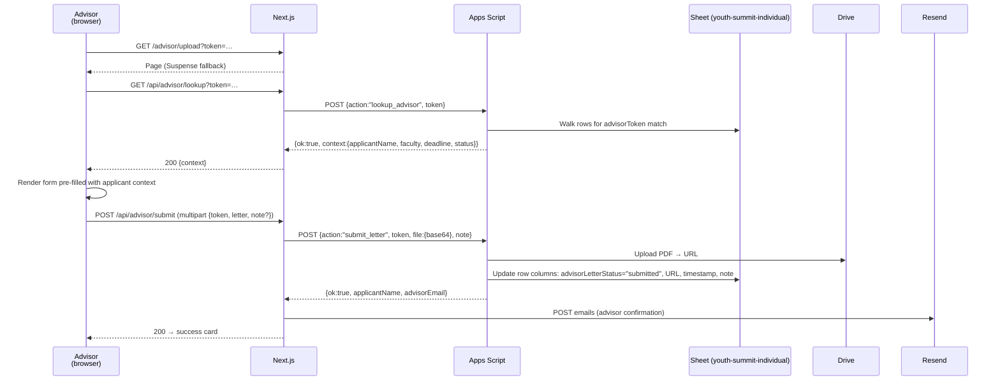
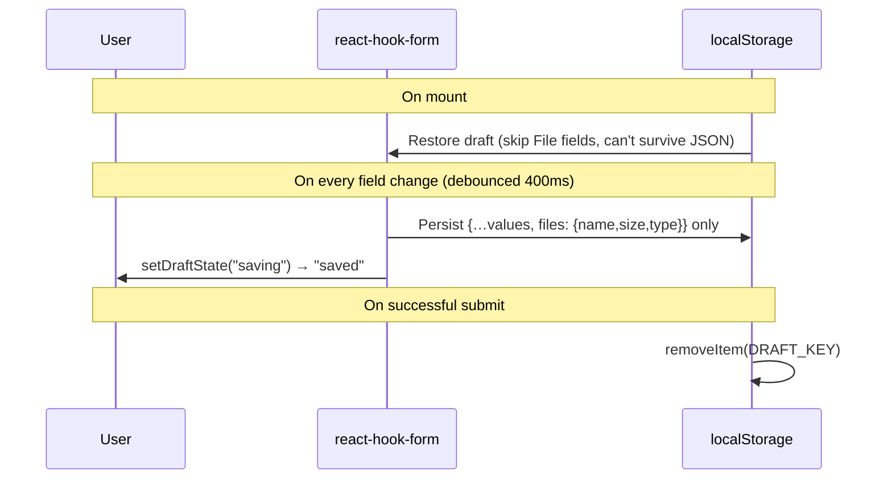

# Gen SEA Summit 2026 — System Design

A single-page application platform for the Gen SEA Summit 2026 program. Two
application tracks (individual delegates, startup ventures) feed into a
Google Sheet via an Apps Script web app. Confirmation emails are sent through
Resend. Advisors upload recommendation letters through a token-protected page.
No backend database, no service-account keys.

> Last updated: 2026-04-30 (refreshed against current `main`).
> When the architecture changes, update this file in the same PR.

---

## 1. Goals & Non-Goals

**In scope**
- Two single-page application forms: Individual (delegates) and Startup (ventures).
- Pre-filled drafts (localStorage) so partial entries survive page refreshes.
- Server-side persistence of every submission to a Google Sheet.
- File uploads (CV, pitch deck, video) saved to Google Drive with shareable links.
- Transactional confirmation emails (4 templates) sent via Resend, with optional
  configurable founder/CEO signature block.
- Advisor letter upload flow: token-protected `/advisor/upload` page, lookup by
  token, PDF upload to Drive, row update + confirmation email.
- Public marketing landing page with audience toggle and per-track content.
- Admin diagnostic endpoint (`/api/admin/sheets-ping`) for verifying integration health.

**Out of scope (deliberately)**
- Authentication / accounts. Submissions are anonymous; each generates a
  random `applicationId`.
- Real-time database or admin dashboard. The Sheet is the dashboard.
- Multi-language UI. English only at present (i18n provider remains as a
  passthrough so it can be re-enabled).
- Payment / scholarship tooling.

---

## 2. Tech Stack

| Layer | Choice |
|---|---|
| Framework | Next.js **14.2** (App Router), React **18.3** |
| Language | TypeScript **5.6** |
| Styling | Tailwind CSS **3.4** + small `globals.css` component layer |
| Forms | `react-hook-form` **7.53** + `@hookform/resolvers` **3.9** |
| Validation | `zod` **3.23** |
| Icons | `lucide-react` |
| Fonts | Geist Sans (latin), IBM Plex Sans Thai (Thai fallback) |
| Email | **Resend** REST API via `fetch` (no SDK install) |
| Persistence | Google **Apps Script** Web App → Google Sheets + Drive |
| Hosting | **Vercel** |
| Runtime | Node.js (Vercel) — API routes use the Edge-compatible `fetch` global |

No additional npm dependencies are required for email or persistence — both
talk directly to their respective HTTPS endpoints.

---

## 3. High-Level Architecture



**Key property:** the Next.js server is the only component holding shared
secrets. Browser JS never sees the Apps Script URL, the shared secret, or
the Resend API key. All third-party calls happen server-side from API
routes.

---

## 4. Routes & Pages

### App Router file map

```
app/
├─ layout.tsx                       Root metadata (title, OG image, favicon)
├─ page.tsx                         Marketing landing page
├─ apply/
│  ├─ page.tsx                      → redirects to /#tracks
│  ├─ delegate/
│  │  ├─ page.tsx                   Individual application form
│  │  └─ success/page.tsx           Post-submit thank-you
│  └─ venture/
│     ├─ page.tsx                   Startup application form
│     └─ success/page.tsx           Post-submit thank-you
├─ advisor/
│  └─ upload/
│     ├─ page.tsx                   Suspense wrapper
│     └─ view.tsx                   Token lookup → upload form / success / error
└─ api/
   ├─ admin/
   │  └─ sheets-ping/route.ts       GET → diagnostic (env-var presence + Apps Script reachability)
   ├─ advisor/
   │  ├─ lookup/route.ts            GET ?token=… → applicant context
   │  └─ submit/route.ts            POST multipart → letter to Drive + row update + email
   └─ apply/
      ├─ individual/route.ts        POST → Sheet + 2 emails
      └─ startup/route.ts           POST → Sheet + 1 email
```

### URL summary

| URL | Method | Purpose |
|---|---|---|
| `/` | GET | Landing page with audience toggle |
| `/?track=individual` | GET | Pre-selects the Individual track via query param |
| `/?track=startup` | GET | Pre-selects the Startup track |
| `/apply` | GET | 307 redirect to `/#tracks` |
| `/apply/delegate` | GET | Individual form |
| `/apply/delegate/success` | GET | Confirmation page after individual submit |
| `/apply/venture` | GET | Startup form |
| `/apply/venture/success` | GET | Confirmation page after startup submit |
| `/advisor/upload?token=…` | GET | Advisor letter upload page (resolved client-side via token) |
| `/api/apply/individual` | POST | Multipart form-data; writes Sheet, sends 2 emails |
| `/api/apply/startup` | POST | Multipart form-data; writes Sheet, sends 1 email |
| `/api/advisor/lookup` | GET | `?token=…` → applicant context (404 on unknown token) |
| `/api/advisor/submit` | POST | Multipart `{token, letter, note?}` → upload + row update + email |
| `/api/admin/sheets-ping` | GET | Diagnostic. `?ping=1` also probes Apps Script reachability + secret match |

---

## 5. Component Architecture

### Landing page (`app/page.tsx`)

```
Header (sticky, brand mark + skip link)
  Hero (gradient headline + CTA → #tracks)
  ThemeSection (program theme + sponsor block)
  TracksArea  ──(client)──>  AudienceToggle  +  TrackIndividual | TrackStartup
                                                  ├─ TrackSwitchLink
                                                  └─ SectionCard × 3
                                                      (What you get / How to apply / Timeline)
  FinalCta
Footer
```

`TracksArea` is wrapped in a `<Suspense>` boundary because it reads
`useSearchParams()` to resolve the track. The toggle state is persisted in
the URL (`?track=…`), so deep links from social posts open the right track
immediately.

### Apply forms

Both forms share the same shell:

```
sticky header (BrandMark + Back link)
  page header (kicker + h1 + DraftIndicator)
  <form>
    fieldset[…]      one fieldset per logical section (Personal info, …)
      Field          shared label/input primitive (auto-paired via useId)
      Field
      …
    submit row       Drafts notice + primary submit button
  </form>
```

Shared primitives in `components/apply/`:

- `Field` — wraps an input with a properly-paired `<label htmlFor>` (uses
  `useId()`), renders an "(required)" marker that's visible-and-screen-reader
  friendly, and surfaces error messages from the schema.
- `FormFooter` — back/submit pair with loading state.
- `YesNo` / `ConsentCheckbox` — radio + checkbox primitives.
- `UniversityCombobox` — searchable, keyboard-accessible combobox over
  `lib/data/universities.ts` (~140 entries).
- `DraftIndicator` — "Saving draft… / Draft saved" status pill.
- `FormError` — translates Zod error keys via the i18n provider.

---

## 6. Data Flow

### 6.1 Individual application — happy path



**All three side effects run via `Promise.allSettled`.** Any individual
failure is logged but does not block the HTTP 200 response — the user
should never see an error caused by a flaky third party. Failed writes
must be reconciled manually from server logs.

### 6.2 Startup application

Same shape, simpler payload:

- One Sheet row to the `youth-summit-startup` tab.
- One email — founder confirmation only (no advisor flow).
- Two file uploads (`pitchDeck` required, `videoFile` optional). Either is
  base64-encoded and uploaded to the same Drive folder by Apps Script.

### 6.3 Advisor letter upload

Triggered when the advisor clicks the link in their recommendation-request
email (`/advisor/upload?token=<advisorToken>`).



The token has 96 bits of entropy (16 hex chars from `crypto.randomUUID()`).
Re-submission is allowed — the advisor can replace a previously uploaded
letter; the row's URL/timestamp simply updates.

### 6.4 Draft persistence (client-side)



Draft storage keys: `gen-sea-individual-draft-v3`, `gen-sea-startup-draft-v3`.
Bumping the version at the end is the migration strategy when the schema
changes incompatibly.

---

## 7. Persistence Layer

### 7.1 Why Apps Script + Sheets

- **No DB to operate.** Anyone can edit, filter, share the Sheet directly.
- **No service-account keys** to rotate or leak. The script runs as the
  Sheet owner under their existing Google permissions.
- **Free at this volume.** Apps Script web apps tolerate ~6 minutes/day of
  invocation time on personal accounts; far above what an application
  window of a few weeks needs.
- **Auto-schema.** The Apps Script discovers headers from the first row it
  writes. Adding a field in the API route auto-adds a column on the next
  write — no migration needed.

### 7.2 Apps Script contract

The script exposes a single `POST` endpoint via `doPost`, with three actions
discriminated by the request body. All requests carry a shared secret (URL
alone is insecure since Apps Script Web App URLs are publicly invokable):

```json
// Default action — append a row
{
  "secret": "<GSHEET_SHARED_SECRET>",
  "tab": "youth-summit-individual" | "youth-summit-startup" | "youth-summit-advisor_letter",
  "row": {
    "fieldName": "value",
    "cv": { "fileName": "...", "mimeType": "application/pdf", "base64": "…" }
  }
}

// action: "lookup_advisor" — resolve advisorToken → applicant context
{
  "secret": "...",
  "action": "lookup_advisor",
  "token": "<16-hex-chars>"
}

// action: "submit_letter" — upload letter + mark row submitted
{
  "secret": "...",
  "action": "submit_letter",
  "token": "<16-hex-chars>",
  "file": { "fileName": "...", "mimeType": "application/pdf", "base64": "…" },
  "note": "optional advisor note"
}
```

**Server-side flow (default / write row):**
1. Verify `secret` matches the script's hard-coded `SHARED_SECRET`. Reject
   with `{ok:false, error:"Forbidden"}` otherwise.
2. Look up the target tab in the allowed list. Auto-create it if missing.
3. For any object value with `{fileName, mimeType, base64}`, upload the blob
   to the configured Drive folder (sharing: anyone with link, view-only) and
   replace the value with the file URL.
4. Compare incoming row keys with the existing header row. Append new headers
   as columns at the end.
5. Append the row.
6. Return `{ok:true, row:<N>}`.

**Server-side flow (`lookup_advisor`):**
1. Verify secret.
2. Walk every row in the `youth-summit-individual` tab; find the one where
   the `advisorToken` column matches.
3. Return `{ok:true, context:{applicantName, applicantEmail, university,
   faculty, advisorName, advisorEmail, deadline, status}}`. Status is
   `"pending"` unless the row has `advisorLetterStatus === "submitted"`.

**Server-side flow (`submit_letter`):**
1. Verify secret.
2. Look up the row by token. 404 if missing.
3. Upload the PDF to Drive.
4. Update the row's `advisorLetterStatus`, `advisorLetterUrl`,
   `advisorLetterSubmittedAt`, `advisorLetterNote` columns (auto-creates
   missing columns).
5. Return `{ok:true, applicantName, advisorEmail}` so the API route can
   send the confirmation email without a second round-trip.

### 7.3 Tabs and columns

Tab names are prefixed `youth-summit-` to namespace this program's data
inside a Sheet that may also contain other workbooks.

| Tab | Owner of writes | Notable columns |
|---|---|---|
| `youth-summit-individual` | `/api/apply/individual` (rows) and advisor `submit_letter` action (updates) | `applicationId`, `advisorToken`, `fullName`, `email`, `university`, `faculty`, `motivation`, `cv` (Drive URL), `advisorEmail`, `advisorLetterDeadline`, `advisorLetterStatus`, `advisorLetterUrl`, `advisorLetterSubmittedAt`, `advisorLetterNote` |
| `youth-summit-startup` | `/api/apply/startup` | `applicationId`, `legalName`, `sector`, `founderEmail`, `founderAge`, `pitchDeck` (Drive URL), `videoUrl` / `videoFile` (Drive URL), `bootcampUrl`, `teamFlowUrl` |
| `youth-summit-advisor_letter` | reserved (allowed by the script but currently unwritten) | — letters update existing rows in `youth-summit-individual` rather than spawning new rows here |

Column order is determined by the order keys appear in the API route's `row`
object on the **first write to a tab**. To re-order, delete and re-create
the tab. To add a new column, just include the key — the script appends new
headers automatically.

### 7.4 File uploads

`fileToSheetFile()` (`lib/sheets/client.ts`) reads the `File` from the
incoming `FormData` (browser `File` arrives as a Node-side `File` thanks
to Next.js's request adapter), `base64`-encodes it, and packs it into the
JSON payload. Apps Script `Utilities.base64Decode` reverses the process,
creates a `Blob`, and `folder.createFile(blob)` returns a Drive URL.

Defaults: anyone with the link can view the uploaded file. Tighten in the
script if applications contain sensitive PII.

---

## 8. Email System

### 8.1 Provider abstraction

`lib/email/client.ts` is a thin wrapper around Resend's REST API. ~70 lines,
no SDK install. Soft-fails when env vars aren't set so dev environments
don't block on email config. Logs every successful send (including the
resolved Reply-To) for observability.

```ts
sendEmail({
  to: "alice@example.com",
  subject: "…",
  html: "…",
  text: "…",       // both required — plain-text fallback for spam filters
  replyTo?: "team@seabridge.space",
  tag?: "individual-confirmation",  // becomes a Resend dashboard tag
})
```

`reply_to` is sent to Resend as an array (`["team@…"]`) per their preferred
format, and is omitted entirely (rather than sent empty) when not configured.
A warning logs to the server when `EMAIL_REPLY_TO` is unset so the operator
sees it during deploy review.

To swap providers, replace this file. Templates and routes are
provider-agnostic.

### 8.2 Templates (`lib/email/templates.ts`)

| Function | Recipient | Trigger |
|---|---|---|
| `individualConfirmationEmail` | Applicant | Individual form submit |
| `advisorRequestEmail` | Advisor | Individual form submit (parallel with applicant email) |
| `advisorLetterReceivedEmail` | Advisor | After they submit a letter |
| `startupConfirmationEmail` | Founder | Startup form submit |

Each returns `{ subject, html, text }`. HTML uses table-based layout with
inline styles — Gmail strips `<style>` from `<head>`. A shared `shell()`
function wraps every body in identical branding (logo image, program name
kicker, footer disclaimer).

### 8.3 Configurable sign-off / signature

Every email ends with the result of `signOff()`, which renders one of two
forms based on env vars:

- **No env vars set** → "— The Gen SEA Summit team" (default).
- **`EMAIL_SIGNATURE_NAME` set** → personal signature card with name, optional
  title (`EMAIL_SIGNATURE_TITLE`), optional org (`EMAIL_SIGNATURE_ORG`),
  optional circular photo (`EMAIL_SIGNATURE_PHOTO_URL`), optional LinkedIn
  link (`EMAIL_SIGNATURE_LINKEDIN`). Renders identically across HTML and
  plain-text views.

This lets the program owner attach a founder/CEO signature to every
transactional email without touching code.

### 8.4 Sender configuration

| Env var | Required | Purpose |
|---|---|---|
| `RESEND_API_KEY` | yes | Bearer token (`re_…`) |
| `EMAIL_FROM` | yes | `Display Name <address@verified-domain>` — domain must be verified in Resend |
| `EMAIL_REPLY_TO` | recommended | Recipients hitting Reply target this; falls back to From |
| `EMAIL_LOGO_URL` | optional | Override the in-email logo image (defaults to `${NEXT_PUBLIC_APP_URL}/genseasummit-logo.png`) |
| `EMAIL_SIGNATURE_NAME` | optional | Triggers personal signature when set; remaining `EMAIL_SIGNATURE_*` are also optional |

**Reply-To is independent of From.** From must be on a Resend-verified
domain; Reply-To can be any address. If unset, Gmail will direct replies
to the From address.

### 8.5 Inbox avatar (BIMI / Gmail SMTP)

Resend cannot directly set the avatar shown in the Gmail inbox. To get a
brand logo there, set up BIMI (DNS TXT record + DMARC) or send through the
actual Gmail SMTP relay. See `docs/email-branding.md` for both paths.

---

## 9. Form Validation Schemas

### 9.1 Individual (`lib/schemas/individual.ts`)

```ts
{
  fullName:     string(2..120),
  age:          number(18..30),
  nationality:  string(2..80),
  email:        email,
  phone:        /^\+?[\d\s\-()]{7,20}$/,
  university:   non-empty string (id from universities.ts),
  faculty:      non-empty string,
  cv?:          File (PDF, ≤5MB) — OPTIONAL,
  advisorName:  string(2..120),
  advisorEmail: email,
  motivation:   string(1..800),
}
```

A previous `contribution` field (second short-answer question) has been
removed; the form now collects a single open-ended response.

### 9.2 Startup (`lib/schemas/startup.ts`)

```ts
{
  legalName:    string(2..160),
  sector:       "wellness"|"food"|"ai"|"creative"|"education",
  founderName:  string(2..120),
  founderEmail: email,
  founderPhone: phoneRegex,
  founderAge:   number(18..30),
  pitchDeck:    File (PDF, ≤10MB) — REQUIRED,
  videoUrl?:    url | "",
  videoFile?:   File (≤100MB),
}
```

`foundingDate` and `incorporationCountry` were previously required; both have
been removed. They can be re-collected post-shortlist if needed for due
diligence.

### 9.3 Error message keys

Schemas return short string keys (`"required"`, `"invalidEmail"`,
`"fileTooLarge"`, etc.). `components/apply/field-error.tsx` translates
those keys via the i18n provider into recipient-friendly copy at render
time. To add a new error, add the key to both the schema and
`messages/en.json::apply.errors`.

---

## 10. Configuration

`.env.example` is the source of truth. Copy to `.env.local` for development;
mirror in Vercel Project Settings → Environment Variables for production.

| Var | Required | Notes |
|---|---|---|
| `NEXT_PUBLIC_APP_URL` | yes | Absolute production URL. Used to build absolute links in emails and OG metadata. |
| `RESEND_API_KEY` | yes | `re_…` |
| `EMAIL_FROM` | yes | Verified-domain From address |
| `EMAIL_REPLY_TO` | recommended | Where replies land |
| `EMAIL_LOGO_URL` | optional | Override the in-email logo image |
| `EMAIL_SIGNATURE_NAME` | optional | Triggers personal sign-off when set |
| `EMAIL_SIGNATURE_TITLE` | optional | E.g. "Founder & CEO" |
| `EMAIL_SIGNATURE_ORG` | optional | E.g. "SEA Bridge" |
| `EMAIL_SIGNATURE_PHOTO_URL` | optional | Absolute https URL to a square headshot |
| `EMAIL_SIGNATURE_LINKEDIN` | optional | LinkedIn profile URL |
| `GVP_BOOTCAMP_ENROLL_URL` | optional | Replaced into confirmation emails; falls back to `${APP_URL}/bootcamp/enroll` |
| `TEAM_FLOW_INVITE_URL` | optional | Same pattern |
| `GSHEET_WEBHOOK_URL` | yes | Apps Script Web App URL (`https://script.google.com/macros/s/.../exec`) |
| `GSHEET_SHARED_SECRET` | yes | Must match `SHARED_SECRET` in `apps-script.gs`. Use plain alphanumerics — `$` and `#` are mangled by `dotenv` parsers |

**Apps Script edits do not auto-deploy.** After editing the script source,
always: `Deploy → Manage deployments → pencil → New version → Deploy`. The
URL stays the same.

---

## 11. Failure Modes & Recovery

The system is intentionally resilient at the cost of silent partial
failures. Each integration can fail independently without blocking the user.

| Failure | Visible to user | Side effect |
|---|---|---|
| Resend API down / unauthorized | None — submit returns 200 | Confirmation email missed; row still in Sheet. Backfill manually. |
| Apps Script secret mismatch (`Forbidden`) | None | Sheet row missed; emails still sent. **Detect via Vercel function logs (`[sheets]` lines).** Fix secret + redeploy script. |
| Apps Script Drive scope missing | None | Sheet row missed. Fix: in Apps Script editor, run a function that creates a Drive file (re-grants `auth/drive`), then redeploy as new version. |
| Network timeout to Apps Script (>30s) | None | Sheet row missed. Apps Script execution may still complete server-side — check Executions panel before manually re-submitting. |
| Validation fails on submit | "Please fix the N highlighted fields above" banner + scroll to first invalid field | Form blocks |
| Browser back/refresh mid-form | None | localStorage draft restores on remount |

Server-side log conventions:
- `[email]` — Resend issues
- `[sheets]` — Apps Script / network issues
- `[apply/individual]` / `[apply/startup]` — per-submit summary log

---

## 12. Security

| Concern | Mitigation |
|---|---|
| Resend API key exposure | Server-only env var. Browser bundle never sees it. |
| Apps Script Web App URL exposure | URL is publicly invokable by design. Authenticated via `GSHEET_SHARED_SECRET` in the body. |
| Shared-secret rotation | Edit constant in Apps Script + env var simultaneously, then redeploy script and Vercel. No back-compat — old in-flight requests will fail until both sides match. |
| File upload abuse | Type-checked (PDF only for CVs/decks), size-capped (5/10/100MB), no executable types accepted. |
| Spam submissions | None currently. If volume becomes a problem, add a hidden honeypot field + Cloudflare Turnstile. |
| PII in client logs | None — `console.log` is server-only. Form drafts in localStorage are device-local. |
| GDPR / PDPA | Submitting the form is opt-in. The Sheet is the system of record; deletion is a manual operation by the program owner. No third-party tracking pixels. |

---

## 13. Deployment

### 13.1 Vercel

- Connect the GitHub repo to Vercel.
- Set all env vars in **Project Settings → Environment Variables**, scoped
  to **Production + Preview** (not Development).
- Pushes to `main` deploy to production. PRs get preview URLs automatically.

### 13.2 Apps Script

Deployed independently from the GitHub repo. The source lives in
`docs/apps-script.gs` and is copy-pasted into the Apps Script editor.
After edits:

1. Save in editor (`⌘/Ctrl + S`).
2. **Deploy → Manage deployments → pencil icon → New version → Deploy.**
3. Web App URL stays the same. No env-var change needed in Vercel.

### 13.3 First-time Apps Script bootstrap

See `docs/apps-script.md`. Key steps:
1. Create the Sheet with three tabs.
2. Create a Drive folder; copy its ID.
3. Paste `apps-script.gs` into Extensions → Apps Script.
4. Fill in `UPLOAD_FOLDER_ID` and `SHARED_SECRET`.
5. Run `authorizeDriveWrite()` once to grant Drive scope (writing requires
   the full `https://www.googleapis.com/auth/drive` scope, not just
   `drive.readonly`).
6. Deploy as Web App, copy URL into `GSHEET_WEBHOOK_URL`.

---

## 14. Observability

There is no dedicated observability stack. Instead:

- **Vercel function logs** — every `/api/apply/*` invocation logs a summary
  with the application ID and the result of each side effect. `[email]` and
  `[sheets]` namespaced logs surface configuration / network failures.
- **Apps Script Executions panel** — Apps Script editor's left sidebar shows
  every web-app invocation with full payload, runtime, and error stack.
- **Resend dashboard** — every email send is tagged (`tag:` field) and
  searchable. Bounces, opens, and clicks visible there.
- **Google Sheet itself** — sorted by `submittedAt` column, this is the
  authoritative log of who applied when.
- **`GET /api/admin/sheets-ping`** — returns a JSON `config` object showing
  which env vars are set (boolean flags + `GSHEET_SHARED_SECRET_length` so
  parser-mangled secrets are visible). With `?ping=1` it also POSTs a
  diagnostic request to Apps Script and reports `secretMatches: true|false`.
  Use this as the first stop when something stops working — it disambiguates
  "env var missing" from "Apps Script secret mismatch" from "Apps Script
  unreachable" in one HTTP call. Consider gating behind an admin token before
  go-live.

For alerts (e.g., "no submission in N hours during the application window"),
add a Vercel cron or use Apps Script's built-in time triggers to email a
report.

---

## 15. Performance Notes

- Landing page is static-prerendered (`○` in `next build` output). API
  routes are dynamic (`ƒ`).
- The hero image (Unsplash via `next/image`) is `priority`-loaded; below-fold
  imagery uses default lazy loading.
- localStorage draft writes are debounced 400ms — typing speed isn't bound
  by disk I/O.
- Apps Script invocations have a 30-second client-side timeout. Real-world
  invocations including a Drive upload typically run 1–4 seconds.
- Total bundle for the heaviest page (`/apply/delegate`) is ~146kB First
  Load JS. RHF + Zod + the combobox are the bulk of it; further
  optimization is not currently warranted.

---

## 16. Open Items / Future Work

- **Gate the diagnostic endpoint.** `/api/admin/sheets-ping` is currently
  reachable by anyone who guesses the URL. Before public launch, protect
  it behind a simple bearer-token check (env var + header comparison) or
  remove it entirely once the integration is stable.
- **BIMI / inbox avatar.** Configure BIMI for the sending domain so emails
  show the brand logo in Gmail's inbox view, not just inside the email.
- **Soft validation for institutional emails.** Advisor email is currently
  a generic `email()` check. Tightening to `.ac.th` or partner-domain
  whitelist prevents typos.
- **Form analytics.** No tracking currently. Adding a privacy-first analytics
  tool (Plausible, Vercel Analytics) would surface drop-off in the form.
- **Internationalization.** The i18n provider exists as a passthrough
  serving English. Re-enable Thai if/when copy is provided.
- **Drive folder permissions audit.** Uploaded files default to "anyone with
  link can view" so reviewers can open them without Google account
  prompts. If applications include sensitive PII, tighten to "owner only"
  and grant per-reviewer access.
- **Per-template signatures.** Currently a single signature applies to all
  four templates. If the advisor request should come from a coordinator
  while the founder confirmation comes from the CEO, the `signOff()` helper
  could accept a per-call override.

---

## Appendix A — File reference

```
app/
  layout.tsx                       Root metadata + LocaleProvider
  page.tsx                         Landing composition
  globals.css                      Tailwind base + component classes (.btn-primary, .field-input, …)
  apply/                           Application forms (see §4)
  advisor/upload/                  Advisor letter upload page (page.tsx + view.tsx)
  api/
    admin/sheets-ping/             Diagnostic endpoint
    advisor/{lookup,submit}/       Advisor API routes
    apply/{individual,startup}/    Application submit endpoints
components/
  landing/                         Hero, ThemeSection, AudienceToggle, TrackIndividual, TrackStartup, FinalCta, SectionCard
  shared/                          BrandMark, Header, Footer, Kicker
  apply/                           Field, FormFooter, YesNo, ConsentCheckbox, FieldError, UniversityCombobox, DraftIndicator
lib/
  cn.ts                            Tailwind class-name combiner
  i18n/provider.tsx                English-only passthrough; can be re-enabled for Thai
  schemas/
    individual.ts                  Individual application Zod schema
    startup.ts                     Startup application Zod schema
    index.ts                       Legacy exports (can be cleaned up)
  data/
    universities.ts                ~140 ASEAN universities
    faculties.ts                   Faculty list per university
  email/
    client.ts                      Resend wrapper (with reply-to + logging)
    templates.ts                   4 templates + signOff() helper
  sheets/
    client.ts                      Apps Script client (writeSheetRow, lookupAdvisorByToken, submitAdvisorLetter, fileToSheetFile)
docs/
  apps-script.md                   Apps Script setup walkthrough
  apps-script.gs                   The Apps Script source (paste into editor)
  email-branding.md                BIMI + Gmail SMTP options for inbox avatar
  system-design.md                 This file
messages/
  en.json                          English copy + error message dictionary
  th.json                          Thai copy (currently unused)
public/
  logo.png                         Header brand mark
  genseasummit-logo.png            Email + OG image
```

---

## Appendix B — Key environment variables, by surface

| Surface | Reads |
|---|---|
| Browser bundle | `NEXT_PUBLIC_APP_URL` (only) |
| Email client | `RESEND_API_KEY`, `EMAIL_FROM`, `EMAIL_REPLY_TO`, `EMAIL_LOGO_URL` |
| Email templates (signOff) | `EMAIL_SIGNATURE_NAME`, `_TITLE`, `_ORG`, `_PHOTO_URL`, `_LINKEDIN` |
| Sheets client | `GSHEET_WEBHOOK_URL`, `GSHEET_SHARED_SECRET` |
| Apply + advisor routes | `NEXT_PUBLIC_APP_URL`, `GVP_BOOTCAMP_ENROLL_URL`, `TEAM_FLOW_INVITE_URL` (+ everything used by email + sheets clients) |
| Diagnostic route | (reads-but-doesn't-expose all of the above) |
| Apps Script (separate) | `UPLOAD_FOLDER_ID`, `SHARED_SECRET` (constants in source) |

**Cross-system invariant:** `GSHEET_SHARED_SECRET` (in `.env.local` /
Vercel) must equal `SHARED_SECRET` (in `apps-script.gs`), byte-for-byte.
Special characters in either side are a known footgun — keep both to
plain alphanumerics + hyphens.